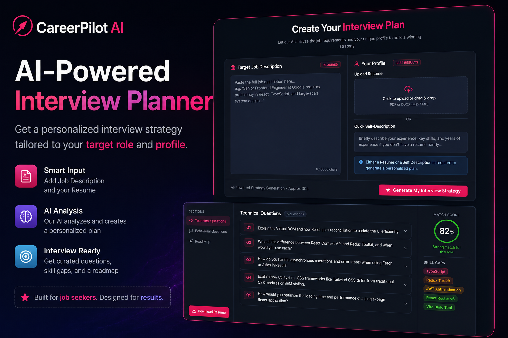

# 🌌 Codesky Portfolio — Personal Developer Portfolio

<p align="center">
  
</p>

<p align="center">


</p>

A modern and fully responsive **Developer Portfolio** built with **React**, **Vite**, and **Tailwind CSS** to showcase my projects, technical skills, achievements, and contact information with a beautiful animated UI.

---

# 🌐 Live Demo

### 🚀 Portfolio

https://codesky.vercel.app/

> Replace this URL with your deployed Vercel URL if different.

---

# 📖 Overview

This portfolio represents my journey as an aspiring **Software Engineer** and **Full Stack Web Developer**.

It highlights my technical skills, featured projects, coding achievements, resume, and provides an easy way for recruiters and developers to connect with me.

---

# ✨ Features

## 🏠 Hero Section

- Professional Introduction
- Animated Background
- Resume Download
- Smooth Scroll Navigation

---

## 👨‍💻 About Me

- Educational Background
- Career Objective
- Personal Introduction

---

## 🛠 Skills

- Frontend Technologies
- Backend Technologies
- Programming Languages
- Database
- Developer Tools

---

## 📂 Featured Projects

- Jupiter Bank (Full Stack Banking Application)
- Sheryians Coding School Clone
- Live Demo Links
- GitHub Repository Links

---

## 📊 Statistics

- 400+ LeetCode Problems Solved
- 100+ GeeksforGeeks Problems Solved
- 10+ Coding Contests Participated
- Smart India Hackathon 2025 – Selected for Round 2
- Manual Robotics Competition Winner

---

## 📩 Contact

- Contact Form
- Social Media Links
- Email
- LinkedIn
- GitHub
- LeetCode
- X (Twitter)

---

# 🎨 UI Highlights

- Fully Responsive Design
- Dark Theme
- Animated Star Background
- Modern Glassmorphism Cards
- Smooth Hover Effects
- Beautiful Icon Animations
- Scroll Animations

---

# 🛠 Tech Stack

## Frontend

- React.js
- Vite
- Tailwind CSS
- JavaScript (ES6+)

---

## Libraries

- React Icons
- Lucide React
- clsx
- tailwind-merge

---

## Deployment

| Service | Platform |
|----------|----------|
| Frontend | Vercel |

---

# 📂 Project Structure

```text
Portfolio
│
├── public
│   ├── projects
│   └── resume.pdf
│
├── src
│   ├── components
│   │   ├── HeroSection.jsx
│   │   ├── AboutSection.jsx
│   │   ├── SkillsSection.jsx
│   │   ├── ProjectsSection.jsx
│   │   ├── StatsSection.jsx
│   │   ├── ContactSection.jsx
│   │   ├── Footer.jsx
│   │   ├── Navbar.jsx
│   │   ├── ThemeToggle.jsx
│   │   └── StarBackground.jsx
│   │
│   ├── hooks
│   ├── lib
│   ├── pages
│   ├── App.jsx
│   └── main.jsx
│
├── package.json
└── README.md
```

---

# 🚀 Getting Started

## Clone Repository

```bash
git clone https://github.com/akash-shit/portfolio.git
```

---

## Install Dependencies

```bash
npm install
```

---

## Start Development Server

```bash
npm run dev
```

---

## Build for Production

```bash
npm run build
```

---

## Preview Production Build

```bash
npm run preview
```

---


# 👨‍💻 Author

## Akash Shit

**Aspiring Software Engineer | Full Stack Web Developer | Problem Solver**

Passionate about building scalable web applications, solving challenging programming problems, and continuously learning modern technologies.

---

# ⭐ Show Your Support

If you like this portfolio, please consider giving the repository a ⭐.

It motivates me to build more amazing open-source projects.
